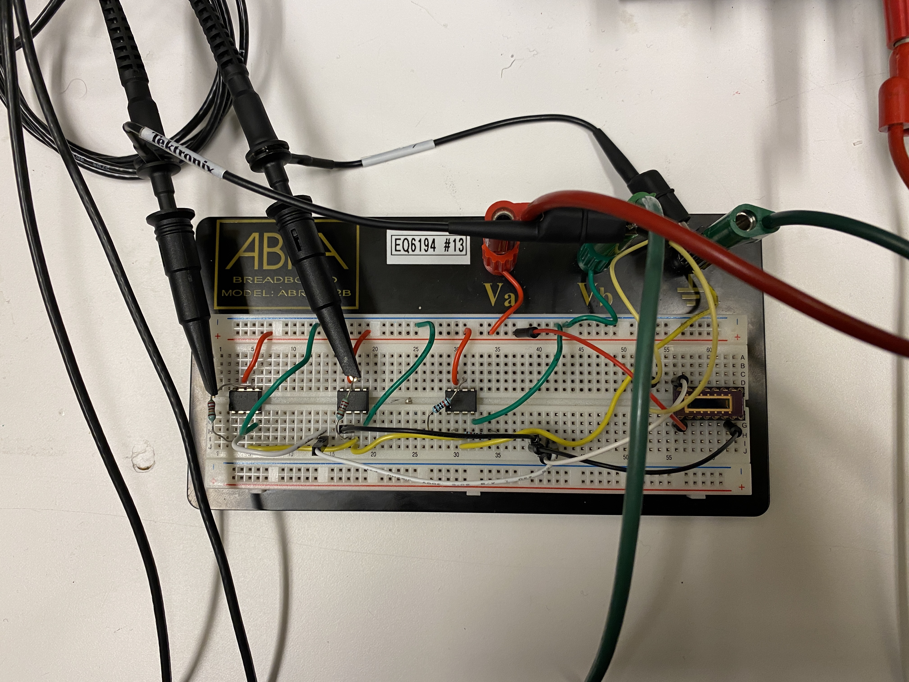

# Electrochemical Sensor Development

As part of my work with the Grutter Group as an undergraduate student, I undertook a project with the goal of building an electrochemical sensor and was responsible for designing the electronic components, calibrating the position sensing detectors and microcantilevers, and setting up a functional optical setup for the sensor.

I had a great time learning more about the theory surrounding this experimental setup and bringing that to life by developing circuits capable of processing the signals received by the sensors in the apparatus. With this project, I was able to grow as a physicist by gaining a different perspective from the background I had from mainly working with data analysis as I was introduced to multiple new techniques in instrumentation.

Here are some pictures I took of the setup I was working with and the circuits I developed!

