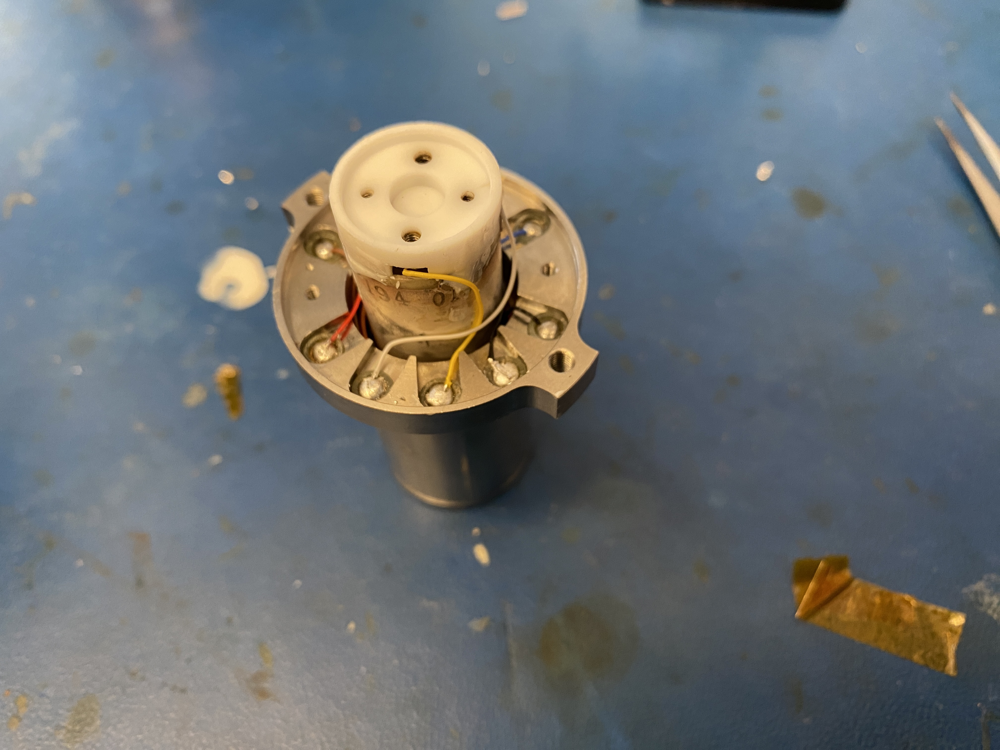

# Quantum Fluctuations

My main project is concerned with studying quantum fluctuations, specifically electron and electron hole pairs in vacuum. To do this, I will be employing an atomic force microscope capable of generating a vacuum (my R2-D2 setup), but before that can be done I have to get the microscope up and running. Currently, most of my efforts have been directed towards setting up the experiment and it has been quite the adventure!

Recently, I repaired the piezoelectric piece on the microscope and I am now going to characterize its behaviour to evaluate its functionality.

If you are curious about this project do not hesitate to [contact me](../../../contact)! I am always happy to talk about my work and exchange ideas.

Attached below are pictures of R2-D2 as dissassembled it to evaluate its function!

